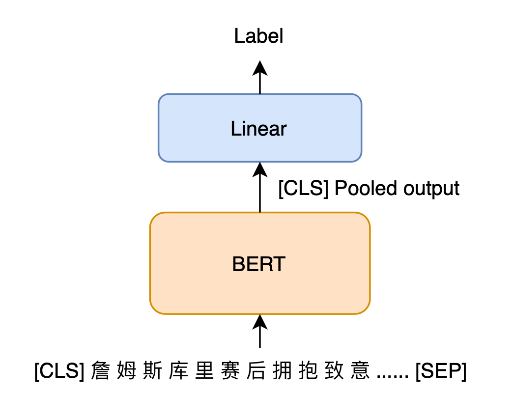

# BertClassifier

（求Star⭐）本项目仅仅提供了最基础的BERT文本分类模型，代码是作者在入门NLP时自己写的，对于初学者还算比较好理解，细节上有不足的地方，大家可以自行修改。读者在使用的时候有任何问题和建议都可以通过邮件联系我。

----
本文利用了[transformers](https://github.com/huggingface/transformers)中的BertModel，对部分cnews数据集进行了文本分类，在验证集上的最优Acc达到了0.88，拿来对[BERT](https://arxiv.org/pdf/1810.04805.pdf)模型练手还是不错的。


<!-- more -->

## 数据描述
数据集是从清华大学的[THUCNews](http://thuctc.thunlp.org/)中提取出来的部分数据。

训练集中有5万条数据，分成了10类，每类5000条数据。
```JSON
{"体育": 5000, "娱乐": 5000, "家居": 5000, "房产": 5000, "教育": 5000, "时尚": 5000, "时政": 5000, "游戏": 5000, "科技": 5000, "财经": 5000}
```

验证集中有5000条数据，每类500条数据。
```JSON
{"体育": 500, "娱乐": 500, "家居": 500, "房产": 500, "教育": 500, "时尚": 500, "时政": 500, "游戏": 500, "科技": 500, "财经": 500}
```

## 模型描述
整个分类模型首先把句子输入到Bert预训练模型，然后将*句子的embedding*（CLS位置的Pooled output）输入给一个Linear，最后把Linear的输出输入到softmax中。


## 环境


|  硬件 | 环境 |
|  ----  | ----  |
| GPU  | GTX1080 |
| RAM  | 64G |

|  软件 | 环境 |
|  ----  | ----  |
| OS | Ubuntu 18.04 LTS |
| CUDA | 10.2 |
| PyTorch | 1.6.0 |
| transformers | 3.2.0 |


~~如果需要数据集，请与我联系.~~

数据集放在了百度网盘上：链接: https://pan.baidu.com/s/1FVV8fq7vSuGSiOVnE4E_Ag 提取码: bbwv


## 使用方法：

> 创建data文件夹，把下载好的cnews数据集放在data文件夹下。

> 创建models文件夹，用来保存模型

> 安装相应依赖库: `pip install -r requirements.txt`

> 训练: `python train.py`

> 预测: `python predict.py`
